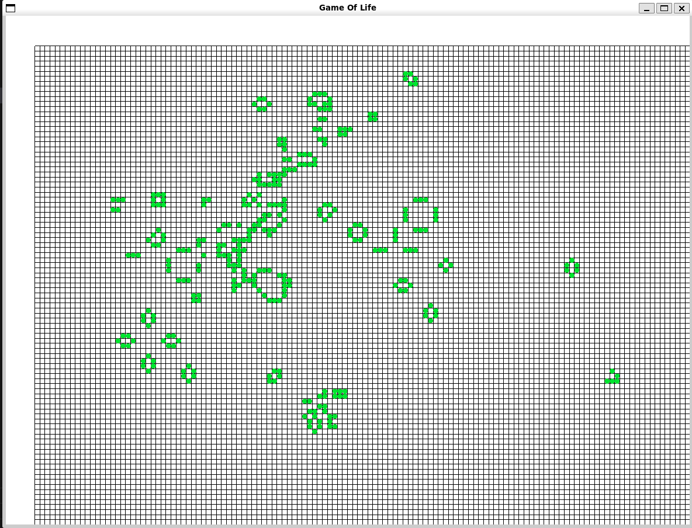

# GAME OF LIFE
This is the simplest implementation of a cellular automata "Conway's Game Of Life" on C and Raylib.



## How to use
Run the compiled executable and draw!
---
```MLB``` - hold to draw cells

```Scroll UP/DOWN``` - zoom in/out

```MMB``` - hold and drag to move the field 

```P``` - pause the game

```C``` - clear the field


# Compile
## Raylib
First of all - get the RayLib libraries:
https://github.com/raysan5/raylib

## Compile
With MakeFile:
```cmd
$ git clone https://github.com/DanielProl1xy/GameOfLife.git
$ cd GameOfLife
$ mkdir build
$ make
```
Otherwise:
```cmd
$ git clone https://github.com/DanielProl1xy/GameOfLife.git
$ cd GameOfLife
$ mkdir build
$ gcc -o build/main main.c -lraylib -lm
```
---
And run:
```cmd
$ cd build
$ ./gol
```